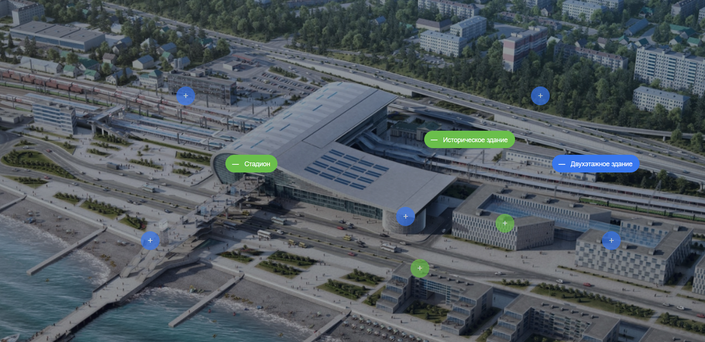
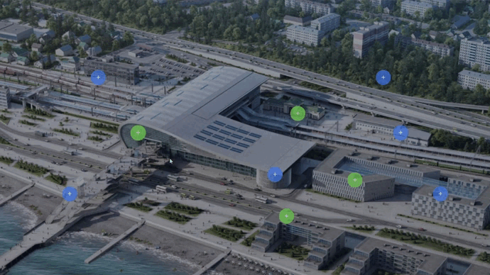

# Проект: Тестовое задание для компании Only.

## Обзор

* Figma
* Сайт проекта
* Описание проекта
* Что использовалось?

## **Figma**

[Ссылка на макет в Figma](https://www.figma.com/file/3gcKt8coTeNhFGnHuHWzjr/%D0%A1%D1%82%D0%B0%D0%B6%D0%B8%D1%80%D0%BE%D0%B2%D0%BA%D0%B0---%D0%A2%D0%B5%D1%81%D1%82%D0%BE%D0%B2%D0%BE%D0%B2%D0%B5-%D0%B7%D0%B0%D0%B4%D0%B0%D0%BD%D0%B8%D0%B5?type=design&node-id=0%3A1&mode=design&t=vrGHG3JQdFUgm3Da-1)

## **Сайт проекта**

[Ссылка на сайт](https://frantsuzovatamara.github.io/test-only/)

## **Описание проекта**

Необходимо было создать блок с фоновым изображения и кнопками, расположенными поверх изображения. По нажатию на каждую кнопку, она “открывается” для отображения подписи того или иного объекта на изображении. Повторный клик по открытой кнопке или по изображению закрывает открытую кнопку

## **Что использовалось?**

* HTML
* CSS
* Методология БЭМ
* JavaScript

